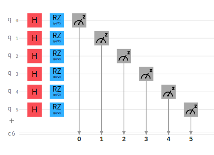

# Generating-Fourier-Basis

## Introduction

Nearly all of the time, the basis that we work in is the eigenbasis of the σ̂ z operator. To go from the computational basis to the Fourier basis for any use case, we use the QFT (quantum Fourier Transform) operator. However, sometimes it might not be possible to use conditional Rotational gates to apply QFT. For this purpose, we will create the QFT operation from scratch by training a variational circuit.

This is the circuit used to create QFT operator 

## What is Quantum Fourier Transform(QFT)?

The Fourier transform occurs in many different versions throughout classical computing, in areas ranging from signal processing to data compression to complexity theory. The quantum Fourier transform (QFT) is the quantum implementation of the discrete Fourier transform over the amplitudes of a wavefunction. It is part of many quantum algorithms, most notably Shor's factoring algorithm and quantum phase estimation.

The discrete Fourier transform acts on a vector (x0,...,xN−1) and maps it to the vector (y0,...,yN−1) according to the formula

where 

Similarly, the quantum Fourier transform acts on a quantum state 

